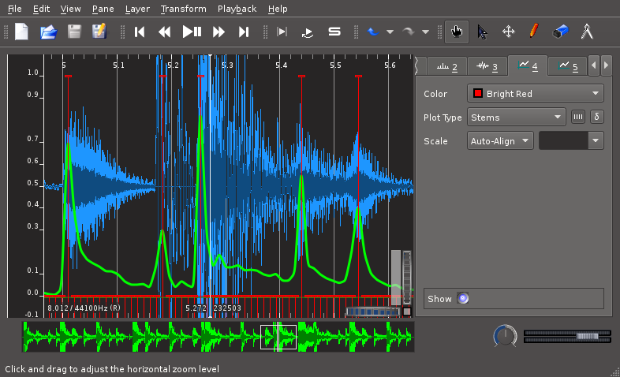

---
---
# Drum Transcription System

Authors: Jakob Leben and Robert Van Rooyen, University of Victoria, Canada

## Overview

The system implements detection of drum hits in monophonic audio, rendering
of detected events into the MIDI file format, evaluation of detection by
comparison with human-provided information, and visualisation of different
stages of processing in the Sonic Visualiser application.

The system consists of three main software components:
- Drum hit detector
- MIDI generator and Evaluator
- Sonic Visualiser plugin

## Detector

The detector takes as input an audio file containing a recording of a musical
performance on drums. It analyses the audio to extract features, which allow
detection of individual drum hits and their properties.

The output is a list of detected drum hits with their time of occurence and
estimated drum type and strength, in form of a file in the CSV
(Comma-Separated Value) format.

Example output:

    0.00580499,0,0.627796
    0.272834,2,0.12992
    0.516644,2,0.141721
    0.667574,2,0.138631
    0.748844,1,0.630138
    1.00426,2,0.195278
    1.24807,2,0.143118
    1.5151,0,0.618974

## Visualisation

The Sonic Visualiser plugin provides insight into the operation of the detector
and allows exploration of its parameters. It re-uses the detector's audio
processing components to visualise the data at various stages of processing.
Audio processing parameters may be tweeked and the resulting data is immediately
re-plotted.

Screenshot: Sonic Vis: onset detection function + onsets

## MIDI generator and Evaluator

This program takes as input the output file of the detector and an additional
file that defines the mapping between drum type and strength values as output
by the detector on one side, and MIDI instrument numbers and note velocities on
the other side. This mapping is used to generate a MIDI file with notes
corresponding to the detected drum hits.

Moreover, this program may also perform a statistical evaluation of the
detector's performance, if provided another MIDI file to serve as ground truth
to compare the detector's output with. The result is information about
the accuracy, precision and recall of drum hit detection, accuracy of
drum type and hit strength evaluation, and the confusion matrix of detected
versus true events, by type.

Example evaluation output:

    Onset: A = 100.0% | P = 100.0% | R = 100.0%
    Type = 66.7%
    Strength = 66.7%
    Confusion matrix:
    ref/det       0       1       2   other  missed
          0       8       0       0       0       0
          1       0       8       0       0       0
          2       8       8      16       0       0
      other       0       0       0       0       0
      ghost       0       0       0       0

## Transcription and Resynthesis Example

This example demonstrates the effectiveness of the transcription system.
Below are links to the original drum recording and audio generated by
resynthesising the transcription in form of a MIDI file produced by the system.
The resynthesised version is a combination of pure resynthesised audio on the
left channel and attenuated original recording on the right channel, for live
comparison.

[Original](audio/kshtc120.wav)

[Resynthesis](audio/kshtc120_resynthesis.wav)

## Acknowledgements

The [Marsyas framework](http://marsyas.info/) is used for composition and
coordination of audio processing components in the detector and the Sonic
Visualiser plugin.

This work is a result of the Music information Retrieval course (CSC 575)
at the University of Victoria, Canada, instructed by prof. George Tzanetakis.

